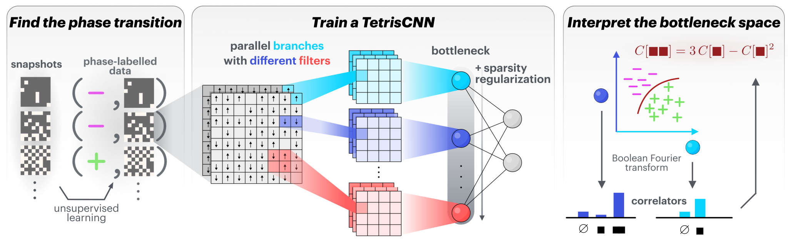

# TetrisCNN

Code accompanying **"TetrisCNN for interpretable detection of phases of matter from
experimental quantum simulator data"**, by *Kacper Cybiński*, *Björn van Zwol*, James
Enouen, Guillaume Bornet, Thierry Lahaye, Antoine Browaeys, Antoine Georges, and
Anna Dawid.

[](https://arxiv.org/abs/2609.20693)  

[](https://doi.org/10.5281/zenodo.14035852)

TetrisCNN is an interpretable convolutional neural network for identifying phases of matter directly from experimental quantum-simulator snapshots. Its latent variables are designed to admit a physical interpretation in terms of spin correlators.

The network processes each snapshot through parallel convolutional branches with deliberately different filter shapes, that is the “Tetris pieces”. Each branch is reduced to a single latent variable, and an L1 penalty encourages the network to retain only the branches needed for the task. Because each filter shape determines, through a Boolean–Fourier expansion, which spin correlators the branch can represent, the surviving branches reveal the correlators used by the network. Both the latent representation and the decision boundary within it can therefore be translated into physically meaningful expressions.

The accompanying manuscript applies TetrisCNN to raw experimental snapshots from Rydberg-atom quantum simulators realizing two-dimensional Ising and XY models.



## Repository structure

| Path | Contents |
| --- | --- |
| `main.py` | Training entry point. Experiments are configured by editing `setup_experiment()`; the code that runs them (sweeps, seeds, re-plotting) is in `tetriscnn/experiments.py`. |
| `sr_toolbox.py` | Optional (App. I): Symbolic regression, run separately after training. Needs `requirements-sr.txt`; see [`docs/SYMBOLIC_REGRESSION.md`](docs/SYMBOLIC_REGRESSION.md). |
| `tetriscnn/` | The library: models, training loop, datasets, interpretation, plotting, and the shared `paper.mplstyle`/`colors.py` notebook styling. |
| `datasets/` | The snapshot data, experimental and simulated. See `datasets/README.md`. |
| `notebooks/` | The `Figure*.ipynb` notebooks that produce the manuscript's figures, one per figure, plus the `BYODataset_Tutorial.ipynb` tutorial on training with your own data. |
| `Plots_data/` | The trained runs those notebooks read, including the appendix-figure `App_*_data/` subfolders. See `Plots_data/README.md`. |
| `docs/` | The configuration reference, the notebook guide, the test-suite reference, and the (optional) symbolic-regression guide. |
| `tests/` | The test suite, including two numerical golden-run fingerprints. See [`docs/TESTING.md`](docs/TESTING.md). |
| `scripts/` | Standalone analyses that are not figures: the parameter surveys behind Tab. V, the LBC summaries the notebooks read, and the two golden-run fingerprint harnesses. Each is run directly, e.g. `python scripts/golden_run.py --check`. |

## Installation

The supported installation uses Conda:

```bash
conda env create -f environment.yml
conda activate tetriscnn
pip install -e .
```

A pip-only installation is available through `requirements.txt`.

### Optional symbolic-regression dependency

The symbolic-regression route (`sr_toolbox.py`, see below) needs PySR, and plotly (with kaleido) for its plots. We keep both out of the main installation because nothing else in the repository uses them. Add them
to the environment with

```bash
pip install -r requirements-sr.txt
```

PySR installs its own Julia runtime the first time it is imported, so that first
import is slow.

To install the development dependencies and verify the installation:

```bash
pip install -r requirements-dev.txt
pytest                                    # the full suite
python scripts/golden_run.py --check      # numerical fingerprint of a reference run
```

Tests that need snapshot data skip cleanly when `datasets/` is absent, so a fresh
clone passes before the data is fetched; `golden_run.py` trains on those snapshots and
reports itself skipped for the same reason, while `golden_bfa_selection.py` needs no
data and always runs. See **[`docs/TESTING.md`](docs/TESTING.md)**
for what each test file covers.

### Optional LaTeX dependency for figures

The figure notebooks' shared style, `tetriscnn/paper.mplstyle` (imported as `PAPER_MPLSTYLE` from `tetriscnn`), renders all text through LaTeX to match
the manuscript's typography, so a TeX distribution with the Latin Modern fonts must be
installed and on the `PATH`: MacTeX on macOS, or on Debian and Ubuntu
`texlive-latex-extra texlive-fonts-recommended cm-super dvipng`. The library, training
and tests do not need it. On macOS, a notebook started from the Dock rather than a
terminal may not see the TeX binaries even when they are installed;
`from tetriscnn import texpath; texpath.ensure_tex_on_path()` before plotting fixes
that, and the module's docstring explains why.

## Data and trained runs

The snapshot tree is documented in **[`datasets/README.md`](datasets/README.md)**:
what each dataset is, where it came from, and how to cite it. In short, `experimental/`
holds the Rydberg-array measurements the manuscript analyses, and `simulated/` holds
the numerically generated 1D transverse-field Ising and 2D Ising lattice gauge theory
configurations TetrisCNN was first developed on.

The data ships separately from the code, as a release asset, to keep the repository
light. Unpack it so that `datasets/` sits at the repository root, or point
`TETRISCNN_DATA_ROOT` at wherever it lives. Verify a copy with
`python scripts/dataset_manifest.py --check`.

The experimental snapshots remain the property of the experimental groups that
produced them. Cite their papers, given in `datasets/README.md`, when using the data.

`Plots_data/` (the trained runs the figure notebooks read, main-text and appendix
alike) ships the same way, as a separate release asset. Unpack it so that
`Plots_data/` sits at the repository root, and verify a copy with
`python scripts/plots_data_manifest.py --check`. See `Plots_data/README.md` for what
each run folder is and which notebook reads it.

Both archives, `datasets.zip` and `Plots_data.zip`, are attached to the release together
with a `SHA256SUMS` file; check a download with `shasum -a 256 -c SHA256SUMS` (or
`sha256sum -c SHA256SUMS` on Linux) before unpacking.

## Train TetrisCNN

There are no command-line arguments. Open `main.py`, edit `setup_experiment()`, and
run it:

```bash
python main.py
```

Every knob is documented in **[`docs/CONFIGURATION.md`](docs/CONFIGURATION.md)**. The
ones that matter most:

```python
cf.dataset      = "Paris_Ising"   # or Paris_XY_{X,Z,XZ}, ILGT, 1D_TFIM_{X,Y,Z}, XXZ
cf.task         = "regression"    # or classification, lbc, partition
cf.kernel_set   = "smallkernels"  # the branch shapes; chainkernels for 1D chains
cf.equivariant  = True            # rotationally invariant (C4) branches, as in the manuscript
cf.lambdas      = [3]             # λmax, the sparsity knob, as a power of ten
cf.seeds        = [42]
```

Fields left unset fall back to the defaults in `tetriscnn.utils.CONFIG_DEFAULTS`, so
only the settings that matter for a run need to be written down; the one modelling
choice that is defaulted, λmax, triggers a warning.

To train on data of your own, write a small processor that reads your files
(usually a subclass of `tetriscnn.dataprocessing.SnapshotProcessor`, which only needs
to be told how to open one file) and register it with `tetriscnn.datasets.register_dataset("MyData", factory)`; after that,
`cf.dataset = "MyData"` works everywhere a built-in dataset does.
[`notebooks/BYODataset_Tutorial.ipynb`](notebooks/BYODataset_Tutorial.ipynb) walks
through the whole route on a synthetic dataset, from files on disk to the fitted
equations of the surviving branches.

A run writes a self-describing folder under `logs/`, holding the full `config.json`,
the training history, the two network checkpoints and its plots. The path encodes the
experiment, dataset, task, kernel set and λ values, so runs never silently overwrite
one another. `docs/CONFIGURATION.md` gives the full layout, including how parameter
sweeps nest and how the remake flags re-plot an existing run without retraining it.

## Interpret a trained model

### Ordinary regression

The **primary** interpretability route is ordinary regression. `tetriscnn/interpret.py`
takes one branch's activation and regresses it onto the spin correlators that the
branch's filter shape can express, returning coefficients, an $R^2$ (for activation-spin correlator mapping) or accuracy (for decision boundary), and LaTeX
labels for each term. This is what produces the manuscript's closed-form readings of
the latent coordinates, such as the Ising branch whose activation is, to within
numerical error, an affine function of the one-site correlator.

Because the exact fit can carry more terms than is useful to quote, the module offers
two pruning routes: an exhaustive best subset of a fixed size, and a greedy forward
selection that yields a nested importance hierarchy with a plateau rule for stopping.
The figure notebooks use the latter and print both for comparison. For any trained run,
`tetriscnn.plots.plot_branch_fits` applies this to every active branch and draws the
coefficients with the fitted equation as each panel's title, either for the full fit
or for the pruned one.

### (optional) Symbolic regression

The **secondary** route is symbolic regression, in `sr_toolbox.py` and Appendix I. It
is best understood as an extractor of an expected form rather than a discovery
mechanism: many expressions fit comparably well, the one PySR returns is largely
dictated by the operator priors handed to it, and no single equation is at once
simple, faithful in-distribution, and robust out of it. The pipeline therefore
evaluates every candidate on synthetic out-of-distribution spin configurations, and
those metrics, not the in-distribution $R^2$, are what its conclusions rest on.
**[`docs/SYMBOLIC_REGRESSION.md`](docs/SYMBOLIC_REGRESSION.md)** describes how to run
it and every setting.

## Reproduce the figures

Every computed figure of the manuscript is produced by a notebook in `notebooks/` (`Figure*.ipynb` and `FiguresApp_*.ipynb`). The notebooks read the recorded runs in `Plots_data/` rather than retraining the models, so they execute in minutes and reproduce the reported figures. **[`docs/NOTEBOOKS.md`](docs/NOTEBOOKS.md)** maps every figure and quoted numerical result to the notebook and cell that generates it. Each notebook also explains the question it addresses, the files it reads, and how to interpret its output.

## Choosing the sparsity strength

Across a broad range of $\lambda_{\max}$, classification accuracy remains almost constant while the learned representation becomes simpler, showing that many representations of different complexity solve the prediction task equally well, and the regularization selects among them. When tuning $\lambda_{\max}$, inspect the branch activations and the complexity of the retained representation rather than accuracy alone.

The selected correlators are those sufficient for the task presented to the network. They need not coincide with a textbook order parameter. Classification tends to favor sharp indicators, whereas regression tends to favor smooth ones, so the two tasks can select different correlators from the same data. Physical judgment remains essential when interpreting the result.

## Citation

```bibtex
@misc{cybinski2026tetriscnn,
  title  = {{TetrisCNN} for interpretable detection of phases of matter from
            experimental quantum simulator data},
  author = {Cybi{\'n}ski, Kacper and van Zwol, Bj{\"o}rn and Enouen, James and
            Bornet, Guillaume and Lahaye, Thierry and Browaeys, Antoine and
            Georges, Antoine and Dawid, Anna},
  year   = {2026},
  eprint = {2609.20693},
  archivePrefix={arXiv},
  primaryClass={cond-mat.dis-nn}
}
```

The method was introduced in an earlier workshop paper, Cybiński, Enouen, Georges and
Dawid, *Speak so a physicist can understand you! TetrisCNN for detecting phase
transitions and order parameters*, Machine Learning and the Physical Sciences Workshop
at NeurIPS 2024.

[](https://arxiv.org/abs/2411.02237)  

## Licence

MIT, see [`LICENSE.md`](LICENSE.md). The licence covers the code. The experimental
snapshots are covered by the terms in `datasets/README.md`.